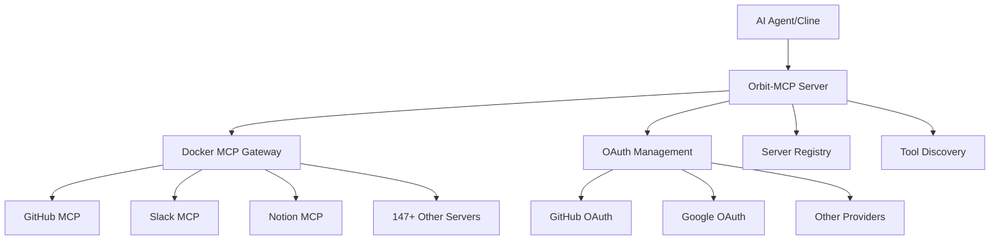

# 🛰️ Orbit-MCP: Meta-MCP Server for AI Toolchain Orchestration

> **"We build and maintain your AI-integrated developer toolchain, so your team can focus on shipping."**

## 🔭 Vision

Orbit-MCP is a **meta-orchestrator** that acts as a central control plane for managing all your AI-accessible developer tools. Instead of every team setting up and maintaining individual MCP servers, Orbit-MCP handles deployment, security, OAuth, permissions, and versioning through a unified interface.

As AI agents become first-class developers, they need secure, structured access to tools your team already uses. Orbit-MCP makes it plug-and-play: a unified, secure, and observable layer between your company's infrastructure and any AI coding assistant.

## ⚡ Key Features

- **🔍 Server Discovery**: Browse 147+ available MCP servers from Docker's catalog
- **🔐 OAuth-First Authentication**: Seamless OAuth flows for GitHub, Google Drive, and more
- **⚡ Dynamic Tool Aggregation**: Enable servers and instantly access their tools
- **🚪 Gateway Management**: Full lifecycle management of Docker MCP Gateway
- **👥 Permission Control**: Team-based access control (coming soon)
- **📊 Audit Logging**: Track tool usage and access patterns (coming soon)

## 🛠️ Available Tools

### Core Management Tools (9 tools)
- **`hello_orbit()`** - Test connectivity and show system status
- **`list_available_servers()`** - Browse 147+ available MCP servers
- **`enable_server(server_name)`** - Enable specific servers with OAuth checking
- **`list_enabled_servers()`** - Show currently enabled servers

### OAuth Authentication (4 tools)
- **`list_oauth_providers()`** - Show available OAuth providers (GitHub, Google Drive)
- **`authorize_oauth(provider)`** - Start OAuth flow (opens browser)
- **`revoke_oauth(provider)`** - Revoke OAuth access
- **`check_server_auth(server_name)`** - Check authentication requirements

### Gateway & Tool Execution (5 tools)
- **`start_gateway()`** - Start Docker MCP Gateway on port 3001
- **`stop_gateway()`** - Stop the gateway
- **`gateway_status()`** - Check gateway status
- **`discover_gateway_tools()`** - List tools from enabled servers
- **`call_gateway_tool(tool_name, args)`** - Execute tools through gateway

### Legacy Tools
- **`list_enabled_tools()`** - Show available tools (with helpful gateway guidance)

## 🚀 Demo Workflow

### Scenario 1: GitHub Integration
```bash
# 1. Check available servers
list_available_servers()
# ✅ Shows 147+ servers including GitHub

# 2. Try to enable GitHub
enable_server("github")  
# ⚠️ "Authentication required. Use authorize_oauth('github')"

# 3. Complete OAuth flow
authorize_oauth("github")
# 🌐 Opens browser for GitHub OAuth consent

# 4. Enable GitHub server
enable_server("github")
# ✅ "Successfully enabled github (OAuth authenticated)"

# 5. Start gateway and discover tools
start_gateway()
# ✅ "Gateway started on port 3001"

discover_gateway_tools()
# 📋 Lists: create_issue, search_repositories, create_pull_request, etc.

# 6. Use GitHub tools directly!
call_gateway_tool("create_issue", {
  "title": "Demo Issue",
  "body": "Created via Orbit-MCP meta-orchestrator!",
  "repository": "username/repo"
})
# ✅ Creates actual GitHub issue! 🎉
```

### Scenario 2: Multi-Service Workflow
```bash
# Enable multiple services
enable_server("github")     # Code repositories
enable_server("slack")      # Team communication  
enable_server("notion")     # Documentation

# Start gateway
start_gateway()

# Discover all available tools
discover_gateway_tools()
# 📋 Shows tools from GitHub, Slack, Notion all in one place

# Use tools from different services seamlessly
call_gateway_tool("create_issue", {...})        # GitHub
call_gateway_tool("send_message", {...})        # Slack  
call_gateway_tool("create_page", {...})         # Notion
```

## 🏗️ Architecture



## 📦 Installation & Setup

### Prerequisites
- Docker Desktop with MCP plugin
- Python 3.12+
- uv package manager

### Quick Start
```bash
# Clone the repository
git clone https://github.com/Wirasm/orbit-mcp.git
cd orbit-mcp

# Install dependencies
uv sync

# Run the MCP server
uv run orbit-mcp-server
```

### Configure with Cline
Add to your Cline MCP settings (`~/.config/cline/mcp_settings.json`):

```json
{
  "mcpServers": {
    "orbit-mcp": {
      "command": "uv",
      "args": [
        "run",
        "orbit-mcp-server"
      ],
      "cwd": "/Path/to/orbit-mcp",
      "env": {
        "PATH": "/opt/homebrew/bin:/usr/local/bin:/usr/bin:/bin"
      }
    }
  }
}
```

## 🎯 Use Cases

### For Development Teams
- **Unified Toolchain**: One interface to access GitHub, Jira, Slack, AWS, etc.
- **OAuth Management**: Centralized authentication for all services
- **Permission Control**: Team-based access to different tool sets
- **Audit Trail**: Track which AI agents used which tools when

### For Individual Developers  
- **Tool Discovery**: Browse and enable from 147+ available MCP servers
- **Quick Setup**: OAuth flows handle authentication automatically
- **Multi-Service Workflows**: Use tools from different services seamlessly

### For DevOps Teams
- **Infrastructure as Code**: Enable AWS, Terraform, Kubernetes tools
- **Monitoring Integration**: Connect to Grafana, DataDog, Sentry
- **Deployment Pipelines**: Integrate with CI/CD tools like CircleCI, Buildkite

## 🗺️ Future Roadmap

### Phase 1: Core Platform ✅
- [x] Server discovery and management
- [x] OAuth-first authentication  
- [x] Dynamic tool aggregation
- [x] Gateway lifecycle management

### Phase 2: Enterprise Features (Next 2 weeks)
- [ ] Pack system (frontend-stack, backend-stack, devops-stack)
- [ ] Team permissions and role-based access
- [ ] Audit logging and usage analytics
- [ ] Web dashboard for visual management

### Phase 3: Advanced Orchestration
- [ ] Workflow automation and chaining
- [ ] Tool recommendation engine
- [ ] Custom server integration
- [ ] Enterprise SSO integration

### Phase 4: SaaS Platform
- [ ] Hosted service option
- [ ] Multi-tenant architecture
- [ ] Billing and usage monitoring
- [ ] Marketplace for custom tools

## 🏆 Competitive Advantages

- **Meta-Orchestrator Approach**: Manage the managers, not individual tools
- **OAuth-First**: Professional authentication vs. hardcoded API keys
- **Docker MCP Integration**: Leverages existing container ecosystem
- **147+ Servers Available**: Massive catalog of pre-built integrations
- **Single Configuration**: One MCP server to manage them all

## 🤝 Contributing

This is a hackathon project, but we welcome contributions! Key areas:

- **Server Integrations**: Add support for new MCP servers
- **Authentication**: Expand OAuth provider support
- **UI/UX**: Web dashboard and visualization
- **Documentation**: Usage examples and tutorials

## 📄 License

MIT License - see LICENSE file for details.

## 🙏 Acknowledgments

- Docker MCP team for the incredible gateway infrastructure
- FastMCP for the Python MCP server framework
- Anthropic for MCP specification and Cline integration
- The broader MCP community for server ecosystem

---

**Ready to orchestrate your AI toolchain?** 🚀

Get started with `uv run orbit-mcp-server` and experience the future of AI-integrated development!